<!-- _class: cover -->

# PROMPTPARK Installation Tools

## คู่มือใช้งานแบบ Step by Step

Local Proxy, HIK LPR Config, Kiosk Installation และ Integration Tools

---

# ภาพรวมเครื่องมือ

PROMPTPARK Installation Tools ใช้สำหรับเตรียมระบบหน้างานตั้งแต่ Local Proxy, กล้อง Hikvision LPR, ตู้ Kiosk ทางเข้า/ทางออก และการทดสอบ integration หลังติดตั้ง

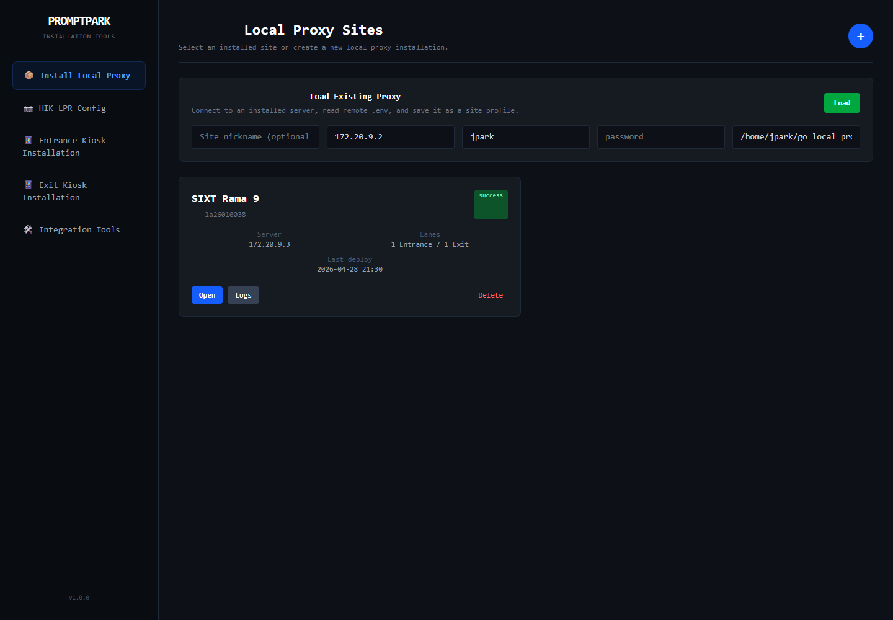

เมนูหลักอยู่ด้านซ้ายของโปรแกรม

---

# เมนูหลักที่ใช้งาน

1. **Install Local Proxy**: สร้างและ deploy Local Proxy API ไปยัง Ubuntu server
2. **HIK LPR Config**: ตั้งค่ากล้อง Hikvision LPR ให้ส่ง event เข้า Local Proxy
3. **Entrance Kiosk Installation**: ติดตั้งและแก้ config ตู้ทางเข้า
4. **Exit Kiosk Installation**: ติดตั้งและแก้ config ตู้ทางออก
5. **Integration Tools**: ยิง mock LPR camera event เพื่อทดสอบ API

---

# Install Local Proxy: หน้า Site List

ใช้หน้านี้เพื่อเลือก site เดิม หรือเริ่มติดตั้ง Local Proxy site ใหม่

<ol class="steps">
<li>เปิดเมนู <strong>Install Local Proxy</strong></li>
<li>กด <strong>New Install</strong> เพื่อเริ่ม wizard</li>
<li>ถ้ามี site เดิม ให้กด <strong>Open</strong> เพื่อแก้ไขหรือ deploy ซ้ำ</li>
</ol>

---

# Install Local Proxy: Step 1 Site Data

กรอกข้อมูลหลักของระบบ

<ol class="steps">
<li>กรอก <strong>Site Nickname</strong></li>
<li>กรอก <strong>Parking Code</strong></li>
<li>ตรวจสอบ <strong>Server URL</strong></li>
<li>กรอก user/password ของกล้องถ้าต้องใช้</li>
</ol>

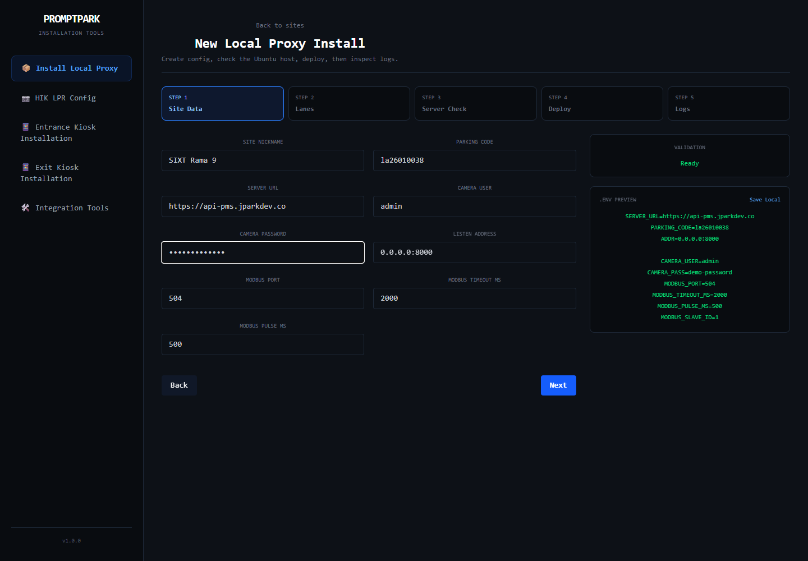

---

# Install Local Proxy: Step 2 Lanes

เพิ่ม lane ทางเข้าและทางออก

<ol class="steps">
<li>เลือกประเภท lane: <strong>Entrance</strong> หรือ <strong>Exit</strong></li>
<li>ระบุหมายเลข gate เช่น 01</li>
<li>กรอก IP ของ Gate, LPR, LIC, DRI</li>
<li>ถ้ามี LED ให้ติ๊ก <strong>LED</strong> และกรอก LED IP</li>
<li>กด <strong>Add Lane</strong></li>
</ol>

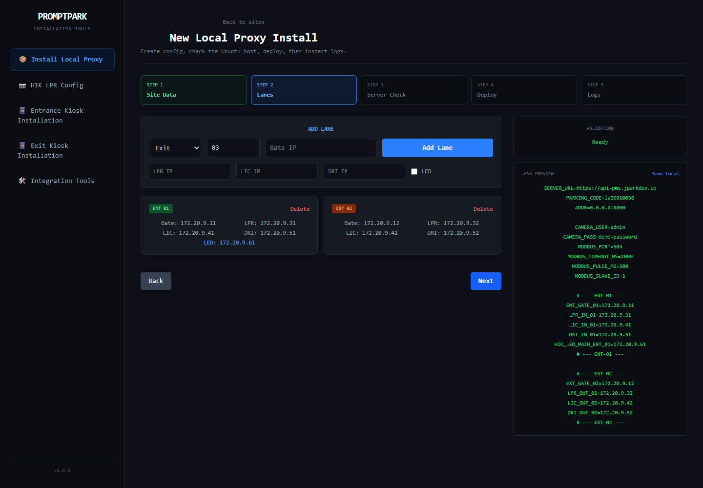

---

# Install Local Proxy: Step 3 Server Check

ตรวจสอบ Ubuntu server ก่อน deploy

<ol class="steps">
<li>กรอก <strong>Server IP</strong></li>
<li>กรอก <strong>SSH Username</strong> และ <strong>SSH Password</strong></li>
<li>ตรวจสอบ <strong>Project Path</strong></li>
<li>กด <strong>Run Preflight</strong></li>
<li>ดูผล OK/FAIL ก่อน deploy</li>
</ol>

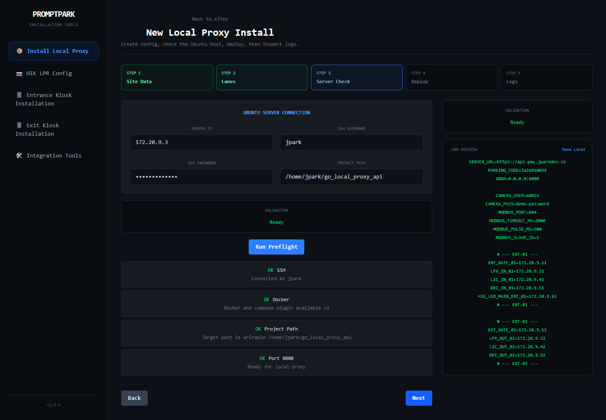

---

# Install Local Proxy: Step 4 Deploy

Deploy หรือแก้ไขไฟล์ `.env` บน server

<ol class="steps">
<li>ตรวจสอบ validation ให้เป็น <strong>Ready</strong></li>
<li>กด <strong>Deploy</strong> สำหรับติดตั้งเต็มรอบ</li>
<li>กด <strong>Save Remote .env</strong> เมื่อต้องแก้ config อย่างเดียว</li>
<li>กด <strong>Redeploy</strong> เพื่อ restart docker compose</li>
<li>ใช้ <strong>Rollback</strong> เมื่อจำเป็นต้องย้อน `.env` ล่าสุด</li>
</ol>

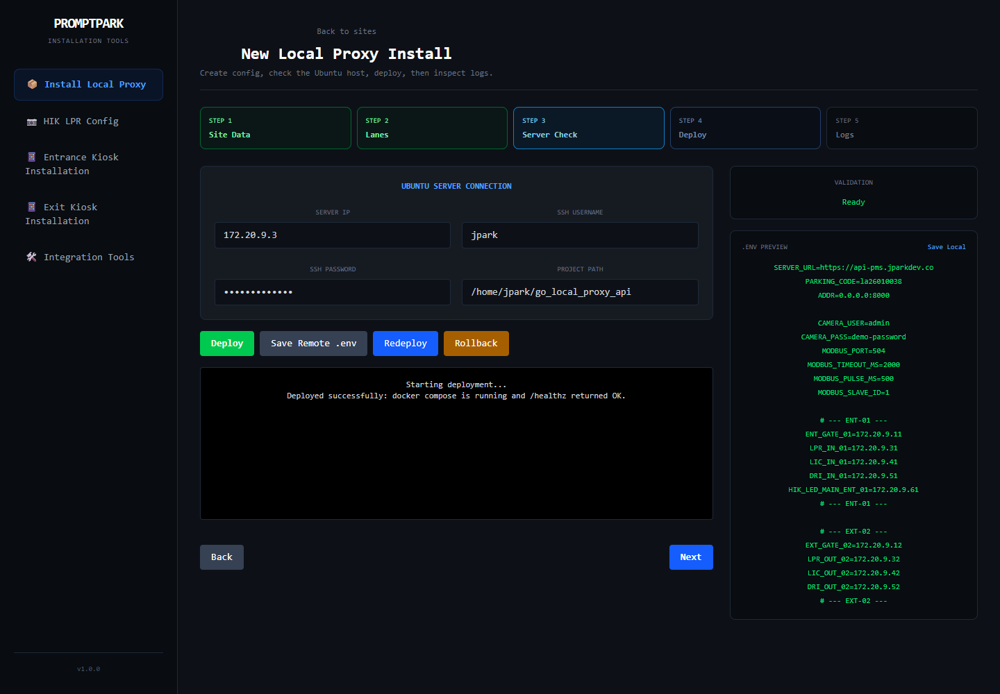

---

# Install Local Proxy: Logs และ History

ใช้หลัง deploy เพื่อตรวจสอบการทำงาน

<ol class="steps">
<li>เปิด tab <strong>Logs</strong></li>
<li>กด <strong>Start Logs</strong> เพื่อดู docker logs</li>
<li>กด <strong>Clear</strong> เมื่อต้องล้างหน้าจอ log</li>
<li>เปิด tab <strong>History</strong> เพื่อดูประวัติ deploy</li>
</ol>

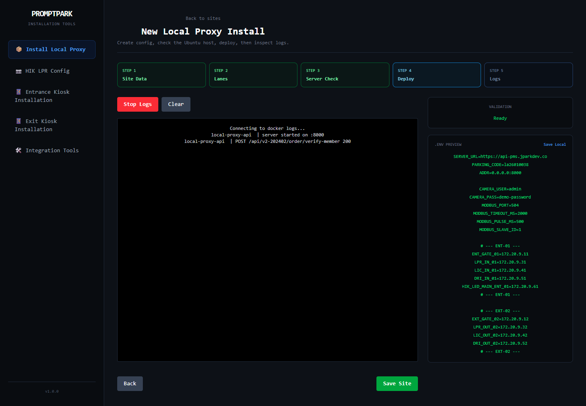

---

# HIK LPR Config: ตั้งค่า Target Server

กำหนด Local Proxy ที่กล้องจะส่ง event เข้าไป

<ol class="steps">
<li>เปิดเมนู <strong>HIK LPR Config</strong></li>
<li>กรอก <strong>Local Proxy IP</strong></li>
<li>ตรวจสอบ port ปลายทาง ปกติใช้ <strong>8000</strong></li>
<li>กด <strong>+ Add Camera</strong></li>
</ol>

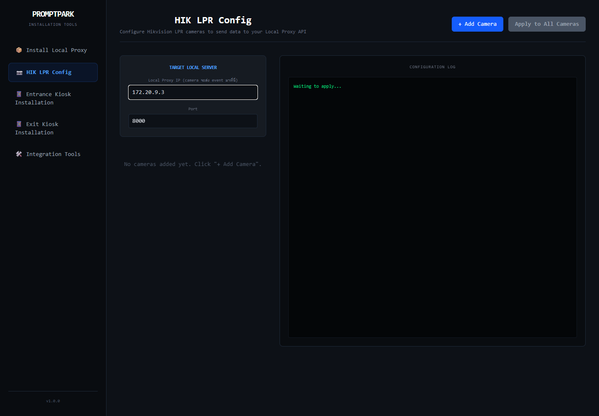

---

# HIK LPR Config: Add Camera

เพิ่มกล้อง LPR แต่ละตัว

<ol class="steps">
<li>กรอก <strong>Camera IP</strong></li>
<li>กรอก username/password ของกล้อง</li>
<li>เลือก <strong>ENTRY</strong> หรือ <strong>EXIT</strong></li>
<li>กรอก <strong>Gate No</strong></li>
<li>ตรวจสอบ Target endpoint แล้วกด <strong>Add Camera</strong></li>
</ol>

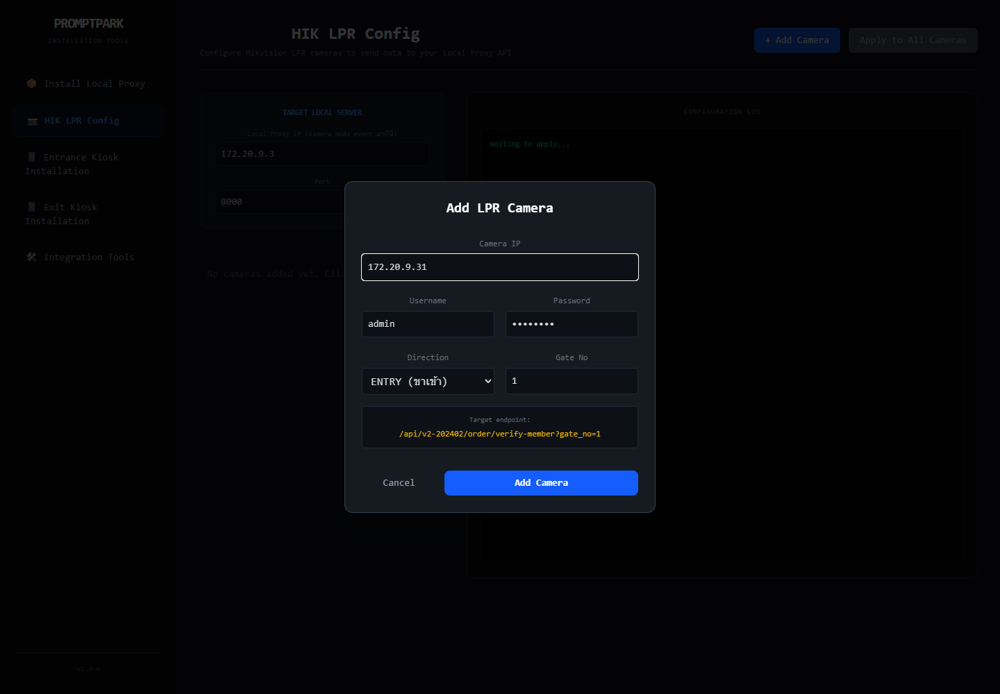

---

# HIK LPR Config: Apply to Cameras

หลังเพิ่มกล้องครบแล้ว ให้ apply configuration

<ol class="steps">
<li>ตรวจสอบรายการกล้องด้านซ้าย</li>
<li>กด <strong>Apply to All Cameras</strong></li>
<li>ดู progress และผลลัพธ์ใน <strong>Configuration Log</strong></li>
</ol>

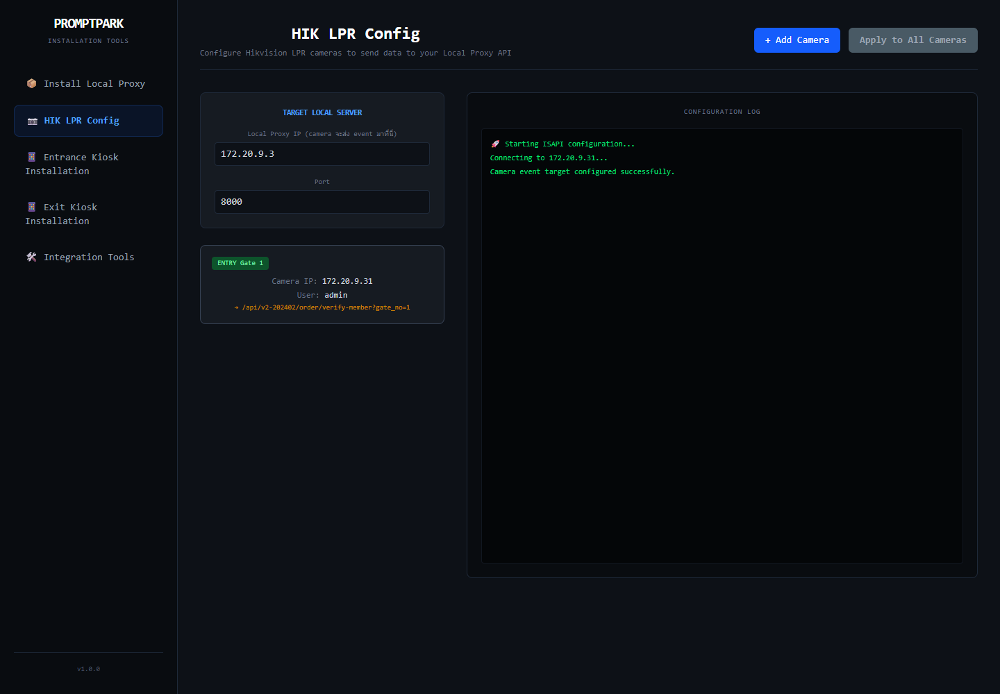

---

# Entrance Kiosk: New Install

ติดตั้งหรือ push config ไปยังตู้ทางเข้า

<ol class="steps">
<li>เปิดเมนู <strong>Entrance Kiosk Installation</strong></li>
<li>เลือก tab <strong>New Install</strong></li>
<li>กด <strong>Browse</strong> เพื่อเลือก APK ถ้าต้องติดตั้ง APK</li>
<li>กรอก Global Config โดยเฉพาะ <strong>Local Server URL</strong></li>
<li>กด <strong>+ Add Device</strong></li>
</ol>

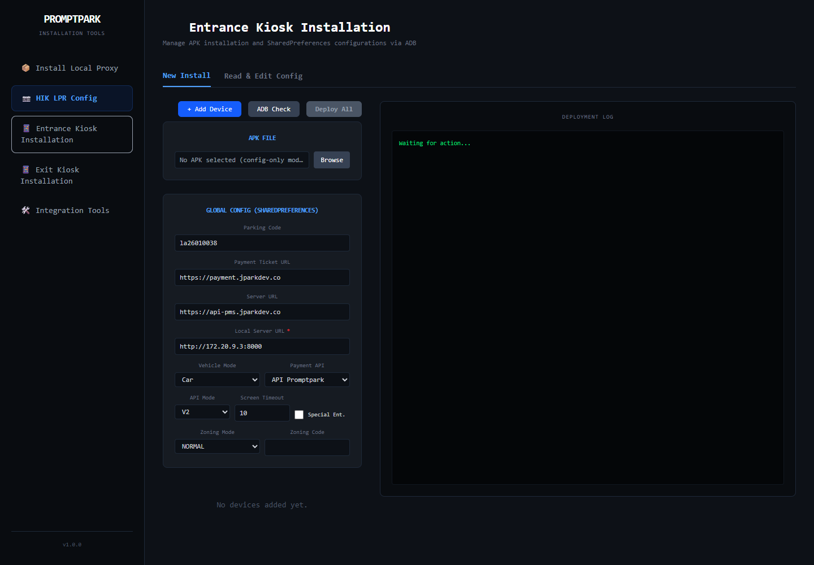

---

# Entrance Kiosk: Add Device

เพิ่มตู้ทางเข้า

<ol class="steps">
<li>กรอก IP ของเครื่อง Kiosk ที่เปิด ADB over WiFi</li>
<li>กรอก Device Name</li>
<li>กรอก Gate No</li>
<li>กรอก PLC/Modbus IP</li>
<li>กด <strong>Add Device</strong></li>
</ol>

---

# Entrance Kiosk: Deploy และ ADB Check

ตรวจสอบ ADB และ deploy

<ol class="steps">
<li>กด <strong>ADB Check</strong> เพื่อตรวจสอบการเชื่อมต่อ</li>
<li>ตรวจสอบรายชื่อ device ที่เพิ่มไว้</li>
<li>กด <strong>Deploy All</strong></li>
<li>ดูผลลัพธ์ใน <strong>Deployment Log</strong></li>
</ol>

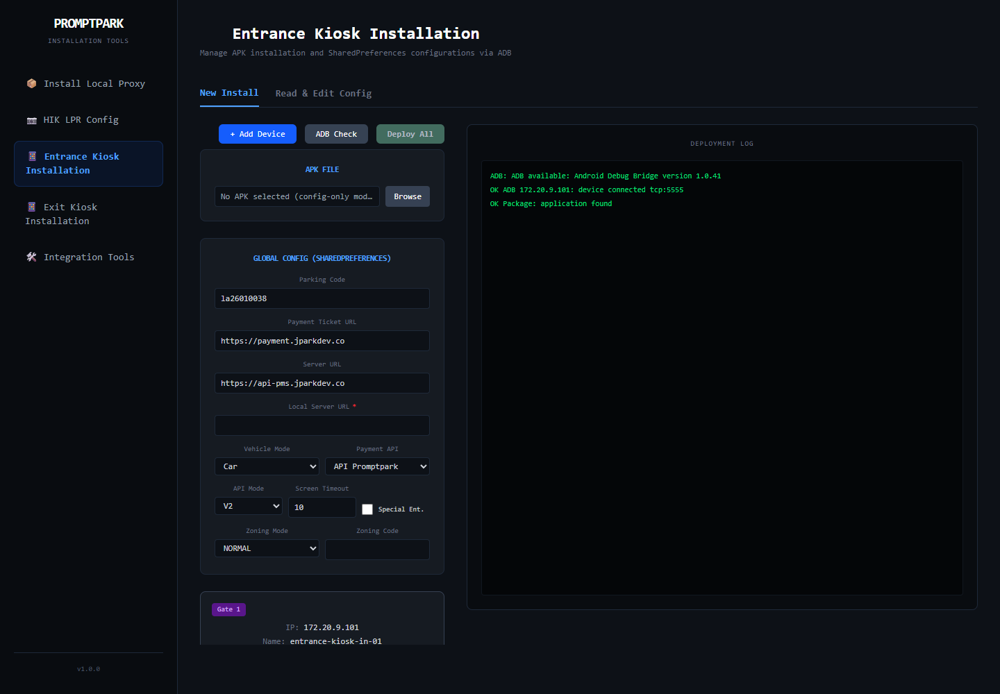

---

# Entrance Kiosk: Read & Edit Config

อ่านและแก้ config จากเครื่องที่ติดตั้งแล้ว

<ol class="steps">
<li>เปิด tab <strong>Read & Edit Config</strong></li>
<li>กรอก Device IP แล้วกด <strong>+ Add</strong></li>
<li>กด <strong>Read Configs</strong></li>
<li>แก้ค่าที่ต้องการ</li>
<li>กด <strong>Save Changes</strong></li>
</ol>

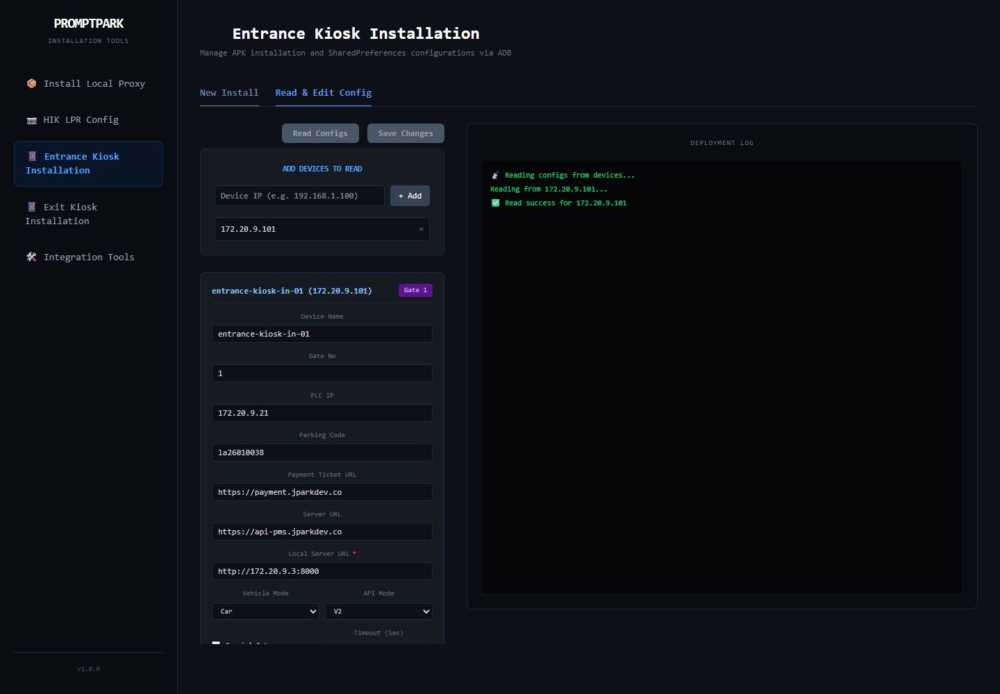

---

# Exit Kiosk: New Install

ติดตั้งหรือ push config ไปยังตู้ทางออก

<ol class="steps">
<li>เปิดเมนู <strong>Exit Kiosk Installation</strong></li>
<li>เลือก tab <strong>New Install</strong></li>
<li>เลือก Exit APK ถ้าต้องติดตั้ง APK</li>
<li>กรอก Global Config และ <strong>Local Server URL</strong></li>
<li>ตั้งค่า Ticket Mode, Cash/QR และ Zoning ตามหน้างาน</li>
</ol>

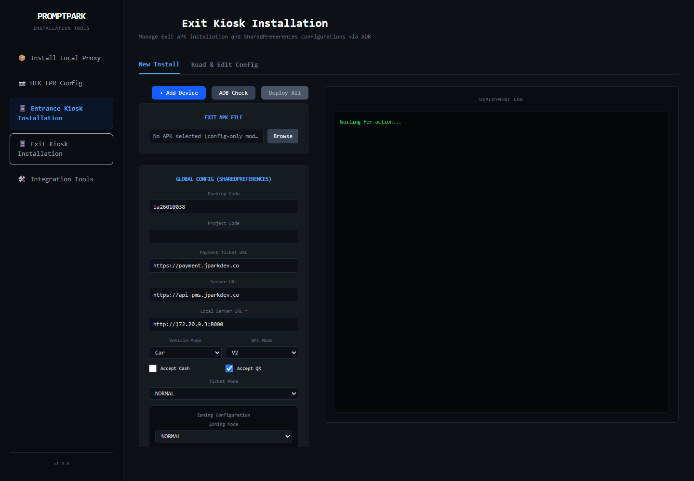

---

# Exit Kiosk: Add Device

เพิ่มตู้ทางออก

<ol class="steps">
<li>กรอก Device IP</li>
<li>กรอก Device Name</li>
<li>กรอก Gate No</li>
<li>กรอก PLC/Modbus IP</li>
<li>กด <strong>Add Device</strong></li>
</ol>

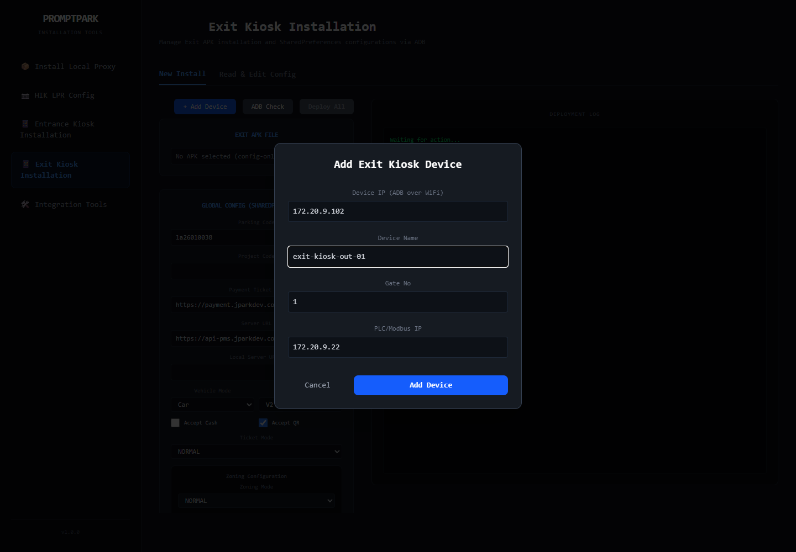

---

# Exit Kiosk: Deploy

ตรวจสอบและ deploy ตู้ทางออก

<ol class="steps">
<li>ตรวจสอบ cash/QR และ ticket mode</li>
<li>กด <strong>ADB Check</strong></li>
<li>กด <strong>Deploy All</strong></li>
<li>ตรวจสอบผลใน <strong>Deployment Log</strong></li>
</ol>

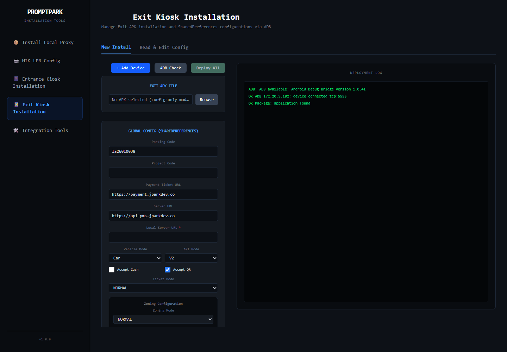

---

# Exit Kiosk: Read & Edit Config

อ่านและแก้ config จากตู้ทางออก

<ol class="steps">
<li>เปิด tab <strong>Read & Edit Config</strong></li>
<li>เพิ่ม Device IP</li>
<li>กด <strong>Read Configs</strong></li>
<li>แก้ค่าที่ต้องการ เช่น Local Server URL, Ticket Mode, Zoning</li>
<li>กด <strong>Save Changes</strong></li>
</ol>

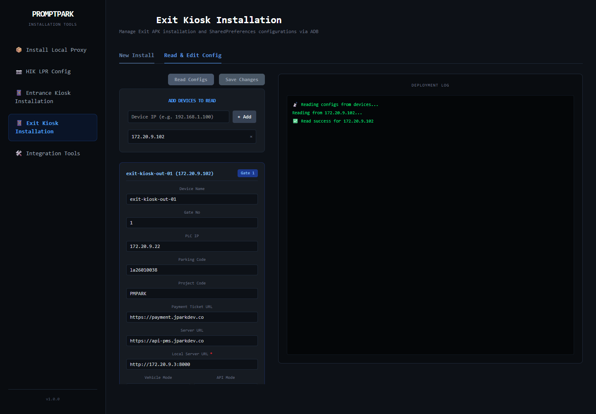

---

# Integration Tools: Mock LPR Event

ใช้ทดสอบ Local Proxy โดยไม่ต้องรอ event จากกล้องจริง

<ol class="steps">
<li>เปิดเมนู <strong>Integration Tools</strong></li>
<li>กรอก <strong>Target Endpoint URL</strong></li>
<li>กรอกทะเบียนรถทดสอบ</li>
<li>กด <strong>Send Mock Event</strong></li>
<li>ตรวจสอบ response ด้านขวา</li>
</ol>

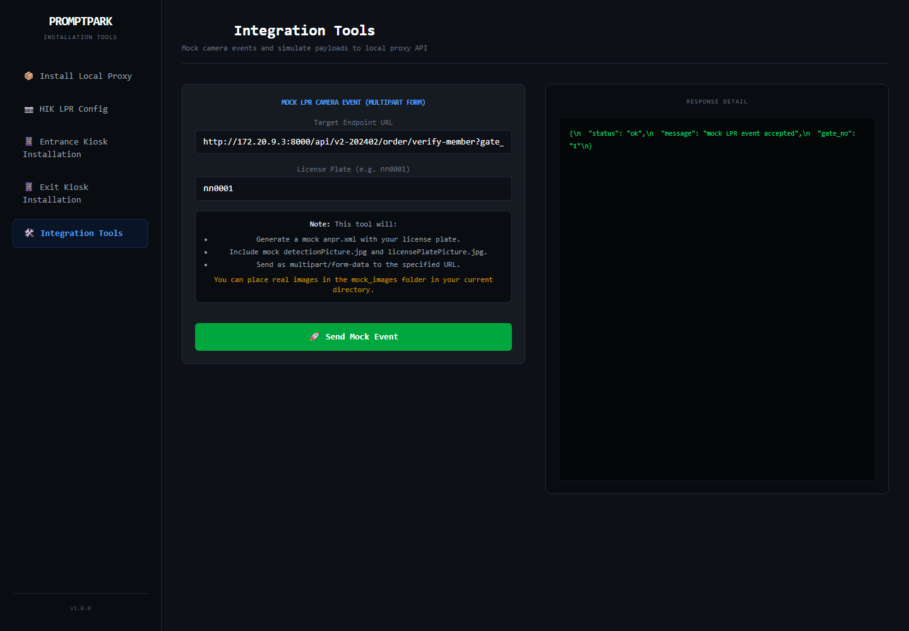

---

# Checklist ก่อนส่งมอบงาน

1. Local Proxy deploy สำเร็จ และ healthcheck ผ่าน
2. กล้อง HIK ส่ง event เข้า endpoint ถูกต้องตาม gate
3. Entrance Kiosk มี Local Server URL ถูกต้อง และเปิดไม้ได้
4. Exit Kiosk มี payment/ticket mode ถูกต้องตาม site
5. Integration Tools ยิง mock event แล้วได้ response จาก Local Proxy

---

# หมายเหตุการใช้งาน

- ควรตรวจสอบ IP plan ของ site ก่อนกรอกข้อมูล
- ควรใช้ Preflight ก่อน deploy Local Proxy ทุกครั้ง
- ควรเก็บ log หลัง deploy สำหรับแนบรายงานหน้างาน
- หากแก้ `.env` บน server ควร backup หรือใช้ปุ่มที่มี backup ให้อยู่แล้ว

